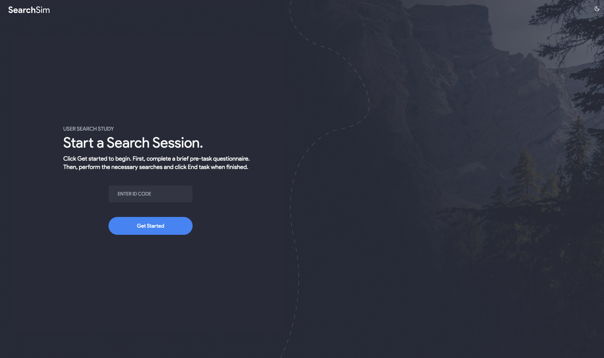

# UXLab: Exploring Conversational and Traditional Search Interfaces in Information Retrieval

Source code for our paper :  
***UXLab: Exploring Conversational and Traditional Search Interfaces in Information Retrieval***


## Overview


https://github.com/saberzerhoudi/UXLab/assets/90967502/183ed1a6-0529-421c-bfc9-07a2eaa7265d
<!-- <p align="center">
  
</p> -->

## Quick Start

### Prerequisites

- [Docker](https://docs.docker.com/get-docker/)
- [Ollama](https://ollama.com/download)
  - Download any of the supported models: **llama3**, **mistral**, **gemma**
  - Start ollama server `ollama serve`


### 1. Clone the Repo

```
git clone git@github.com:saberzerhoudi/UXLab.git
cd searchlab
```

### 2. Add Environment Variables
```
touch .env
```

Add the following variables to the .env file:

#### Required
```
BING_API_KEY=...
```

#### Optional Variables (Pre-configured Defaults)
```
# API URL
NEXT_PUBLIC_API_URL=http://localhost:8000

# Local Models
NEXT_PUBLIC_LOCAL_MODE_ENABLED=true
ENABLE_LOCAL_MODELS=True
```


### 3. Run Containers
This requires Docker Compose version 2.22.0 or later.
```
docker-compose -f docker-compose.dev.yaml up -d
```


Visit [http://localhost:3000](http://localhost:3000) to view the app.

