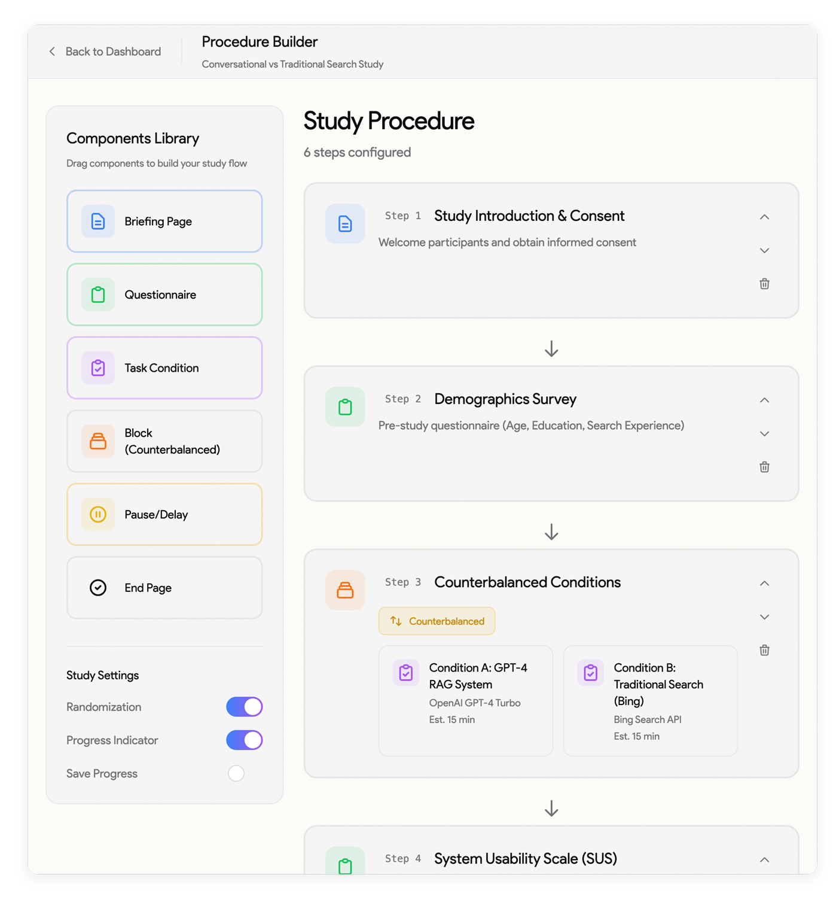
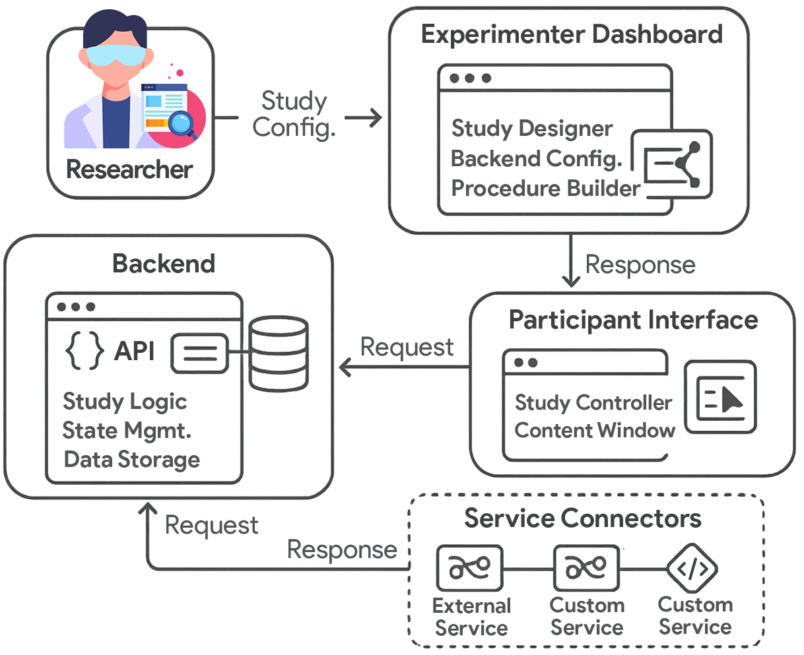

<div align="center">

# From SERPs to Agents: A Platform for Comparative Studies of Information Interaction

### UXLab: A No-Code Platform for Web-Based User Studies of Information Access Systems

*An open-source system for configuring, running, and comparing user studies across search, RAG, and agentic backends without writing code.*

[](https://doi.org/10.1145/3786304.3787948)
[](https://doi.org/10.1145/3786304.3787948)
[](LICENSE)
[](https://fastapi.tiangolo.com/)
[](https://nextjs.org/)
[](https://uxlab.searchsim.org)



**[Saber Zerhoudi](mailto:szerhoudi@acm.org), Michael Granitzer**
Published at the **2026 Conference on Human Information Interaction and Retrieval (CHIIR 2026), Seattle, WA, USA** &nbsp;·&nbsp; pp. 122–126 &nbsp;·&nbsp; [Read the paper](https://doi.org/10.1145/3786304.3787948)

</div>

> **What is this?** Comparing how people interact with different information access systems (traditional search, RAG, autonomous agents) usually means building and operating a separate study apparatus for each one, which is a large technical barrier. UXLab is an open-source platform that removes that barrier: a web dashboard lets researchers configure a full comparative study, from recruitment to backend selection to data export, without writing code.
>
> **Who is it for?** Information retrieval and human-computer interaction researchers who run comparative user studies, and practitioners who want to evaluate search, RAG, and agentic systems with real users.

**Contents:** [Abstract](#abstract) · [Highlights](#highlights) · [Citation](#citation) · [Quick Start](#quick-start) · [Usage](#usage) · [Architecture](#architecture)

---

## Abstract

> The diversification of information access systems, from RAG to autonomous agents, creates a critical need for comparative user studies. However, the technical overhead to deploy and manage these distinct systems is a major barrier. We present UXLab, an open-source system for web-based user studies that addresses this challenge. Its core is a web-based dashboard enabling the complete, no-code configuration of complex experimental designs. Researchers can visually manage the full study, from recruitment to comparing backends like traditional search, vector databases, and LLMs. We demonstrate UXLab's value via a micro case study comparing user behavior with RAG versus an autonomous agent. UXLab allows researchers to focus on experimental design and analysis, supporting future multi-modal interaction research.

**Keywords:** user studies, human-AI interaction, autonomous agents, interactive information retrieval, retrieval-augmented generation, comparative user studies

---

## Highlights

- **No-code study configuration:** a visual dashboard builds complex experimental procedures, so researchers set up a study through the interface without writing code.
- **Pluggable backends:** traditional search, vector-database RAG, LLMs, and autonomous agents are integrated through a common connector interface, making them directly comparable in one study.
- **Built-in experimental design:** between-subject, within-subject, and time-delayed designs are supported, with automatic Latin-square counterbalancing for participant assignment.
- **Reproducible and exportable:** complete study configurations export as shareable JSON, and participant activity is captured as timestamped logs for analysis.
- **Demonstrated in practice:** a micro case study in the paper compares user behavior with a RAG backend versus an autonomous agent.

---

## Citation

If you find UXLab useful in your research, please cite our CHIIR 2026 paper. You can also use the **"Cite this repository"** button in the sidebar (powered by [`CITATION.cff`](CITATION.cff)).

```bibtex
@inproceedings{Zerhoudi:2026:CHIIR,
  author    = {Saber Zerhoudi and Michael Granitzer},
  title     = {From SERPs to Agents: A Platform for Comparative Studies of Information Interaction},
  booktitle = {Proceedings of the 2026 Conference on Human Information Interaction and Retrieval, {CHIIR} 2026, Seattle, WA, USA, March 22-26, 2026},
  pages     = {122--126},
  publisher = {{ACM}},
  year      = {2026},
  url       = {https://doi.org/10.1145/3786304.3787948},
  doi       = {10.1145/3786304.3787948}
}
```

> **ACM Reference Format:** Saber Zerhoudi and Michael Granitzer. 2026. From SERPs to Agents: A Platform for Comparative Studies of Information Interaction. In *Proceedings of the 2026 Conference on Human Information Interaction and Retrieval (CHIIR '26), March 22–26, 2026, Seattle, WA, USA*. ACM, New York, NY, USA, 5 pages. https://doi.org/10.1145/3786304.3787948

---

## Demo

A hosted instance is available at **[uxlab.searchsim.org](https://uxlab.searchsim.org)**.

<p align="center">
  
</p>

---

## Quick Start

### Prerequisites

- [Docker](https://docs.docker.com/get-docker/) with Docker Compose 2.22.0 or later
- [Ollama](https://ollama.com/download) (optional, for local models such as `llama3`, `mistral`, `gemma`; start it with `ollama serve`)

### 1. Clone the repository

```bash
git clone https://github.com/searchsim-org/uxlab.git
cd uxlab
```

### 2. Configure the environment

Create a `.env` file in the repository root:

```bash
# Required: web search backend
BING_API_KEY=your_bing_api_key

# Optional (pre-configured defaults)
NEXT_PUBLIC_API_URL=http://localhost:8000
NEXT_PUBLIC_LOCAL_MODE_ENABLED=true
ENABLE_LOCAL_MODELS=True
```

### 3. Launch with Docker

```bash
docker-compose -f docker-compose.dev.yaml up -d
```

Open [http://localhost:3000](http://localhost:3000) to reach the experimenter dashboard.

---

## Usage

1. Open the experimenter dashboard at `http://localhost:3000`.
2. Create a study and define its procedure in the visual editor: recruitment, tasks, surveys, and topics.
3. Select the backends to compare (for example a search connector against an agentic connector) and choose a study design: between-subject, within-subject, or time-delayed.
4. Enable counterbalancing to have participants assigned automatically via a Latin-square design.
5. Share the participant link, then monitor progress in real time.
6. Export the study configuration as JSON for reproducibility, and export the timestamped interaction logs for analysis.

<details>
<summary><strong>Backend configuration details</strong></summary>

The backend reads credentials and feature flags from `.env`. `BING_API_KEY` enables the web-search connector; `ENABLE_LOCAL_MODELS` toggles Ollama-backed local models; `NEXT_PUBLIC_API_URL` points the frontend at the API. Connector-specific keys (for example an OpenAI or Tavily key) are read from the environment by the corresponding connector when configured.

</details>

---

## Architecture

UXLab has four core components backed by a modular connector layer.

| Component | Path | Role |
|---|---|---|
| Backend API | [`src/backend/`](src/backend/) | FastAPI server managing study logic, participant assignment, and data persistence |
| Experimenter dashboard | [`src/frontend/`](src/frontend/) | Next.js 14 / TypeScript interface for no-code study configuration and monitoring |
| Participant interface | [`src/frontend/`](src/frontend/) | Minimal frontend for study execution and interaction data collection |
| Service connectors | [`src/backend/connectors/`](src/backend/connectors/) | Common interface integrating search, RAG, LLM, and agentic backends |
| Counterbalancing | [`src/backend/counterbalancing.py`](src/backend/counterbalancing.py) | Automatic Latin-square participant assignment |
| Activity logging | [`src/backend/activity_logger.py`](src/backend/activity_logger.py) | Timestamped capture and export of participant interactions |

<details>
<summary><strong>Available connectors</strong></summary>

Connectors implement a shared base interface ([`src/backend/connectors/base.py`](src/backend/connectors/base.py)) and register through [`registry.py`](src/backend/connectors/registry.py):

- `bing_connector.py`: web search via the Bing API
- `tavily_connector.py`: web search via Tavily
- `openai_connector.py`: LLM / RAG backend
- `openai_agentic.py`: autonomous agent backend
- `ollama_connector.py`: local models through Ollama

</details>

---

## Acknowledgments

Developed at the University of Passau. Correspondence: [szerhoudi@acm.org](mailto:szerhoudi@acm.org).

## License

Licensed under the Apache License 2.0. See [LICENSE](LICENSE) for details.

<details>
<summary><strong>Project structure</strong></summary>

```
uxlab/
├── src/
│   ├── backend/           # FastAPI server
│   │   ├── connectors/    # search, RAG, LLM, and agentic backends
│   │   ├── _search/       # search services and interfaces
│   │   ├── db/            # persistence
│   │   ├── counterbalancing.py
│   │   └── activity_logger.py
│   ├── frontend/          # Next.js dashboard and participant interface
│   └── config/            # surveys, topics, and user-study definitions
├── assets/                # figures and demo media
├── docker-compose.dev.yaml
├── Makefile
├── pyproject.toml
└── CITATION.cff
```

</details>

---

## Contact

Open an issue on GitHub, email [szerhoudi@acm.org](mailto:szerhoudi@acm.org), or visit [uxlab.searchsim.org](https://uxlab.searchsim.org).
